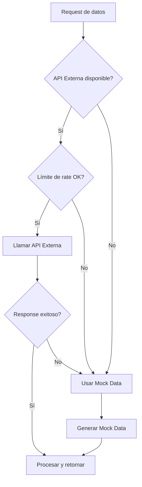

# Estrategia de Consumo de APIs
## Plataforma de Inteligencia y Monitoreo para PYMEs

---

## 1. Resumen Ejecutivo

Este documento define la estrategia para consumir datos de fuentes externas, incluyendo APIs públicas reales y sistemas de mock data como fallback. El objetivo es obtener datos para los 4 módulos de inteligencia de forma confiable y escalable.

---

## 2. APIs Públicas Seleccionadas

### 2.1 Inteligencia de Mercado

#### Opción 1: Alpha Vantage (Recomendada)
- **Descripción:** API de datos financieros y de mercado
- **URL:** https://www.alphavantage.co/
- **Tier Gratuito:** 25 requests/día
- **Autenticación:** API Key
- **Datos Disponibles:**
  - Precios de acciones
  - Indicadores técnicos
  - Datos de commodities
  - Forex

**Ejemplo de Request:**
```bash
GET https://www.alphavantage.co/query?function=TIME_SERIES_DAILY&symbol=MSFT&apikey=YOUR_API_KEY
```

**Ejemplo de Response:**
```json
{
  "Meta Data": {
    "1. Information": "Daily Prices",
    "2. Symbol": "MSFT",
    "3. Last Refreshed": "2026-02-14"
  },
  "Time Series (Daily)": {
    "2026-02-14": {
      "1. open": "420.00",
      "2. high": "425.50",
      "3. low": "418.00",
      "4. close": "423.75",
      "5. volume": "25000000"
    }
  }
}
```

#### Opción 2: Yahoo Finance API (Alternativa)
- **Descripción:** Datos de mercado financiero
- **URL:** https://finance.yahoo.com/
- **Tier Gratuito:** Limitado
- **Nota:** No oficial, usar con precaución

---

### 2.2 Inteligencia de Tendencias

#### Opción 1: News API (Recomendada)
- **Descripción:** API de noticias de múltiples fuentes
- **URL:** https://newsapi.org/
- **Tier Gratuito:** 100 requests/día, 1000 resultados/mes
- **Autenticación:** API Key
- **Datos Disponibles:**
  - Noticias por keyword
  - Noticias por categoría
  - Noticias por fuente
  - Búsqueda histórica (limitada en tier gratuito)

**Ejemplo de Request:**
```bash
GET https://newsapi.org/v2/everything?q=marketing+digital&language=es&apiKey=YOUR_API_KEY
```

**Ejemplo de Response:**
```json
{
  "status": "ok",
  "totalResults": 150,
  "articles": [
    {
      "source": {"id": null, "name": "TechCrunch"},
      "author": "John Doe",
      "title": "El futuro del marketing digital en 2026",
      "description": "Análisis de tendencias...",
      "url": "https://example.com/article",
      "publishedAt": "2026-02-14T10:00:00Z",
      "content": "..."
    }
  ]
}
```

#### Opción 2: Twitter API v2 (Opcional)
- **Descripción:** Datos de tweets y tendencias
- **URL:** https://developer.twitter.com/
- **Tier Gratuito:** Limitado (Essential access)
- **Autenticación:** OAuth 2.0
- **Nota:** Requiere aprobación de cuenta de desarrollador

---

### 2.3 Inteligencia de Predicción

#### Datos Propios + Algoritmo Interno
- **Fuente:** Datos históricos de la propia plataforma
- **Algoritmo:** Regresión lineal simple implementada en PHP
- **No requiere API externa**

**Implementación:**
```php
class PredictionService {
    public function linearRegression($data) {
        // Implementar regresión lineal
        // y = mx + b
    }
}
```

---

### 2.4 Inteligencia de Innovación

#### Opción 1: Product Hunt API (Recomendada)
- **Descripción:** Productos y tecnologías emergentes
- **URL:** https://api.producthunt.com/
- **Tier Gratuito:** Disponible con limitaciones
- **Autenticación:** OAuth 2.0
- **Datos Disponibles:**
  - Productos nuevos
  - Categorías de tecnología
  - Votaciones y comentarios

**Ejemplo de Request:**
```graphql
{
  posts(first: 10) {
    edges {
      node {
        name
        tagline
        votesCount
        topics {
          edges {
            node {
              name
            }
          }
        }
      }
    }
  }
}
```

#### Opción 2: GitHub Trending API (Alternativa)
- **Descripción:** Repositorios trending
- **URL:** https://api.github.com/
- **Tier Gratuito:** 60 requests/hora (sin auth), 5000 con auth
- **Datos:** Tecnologías y herramientas populares

---

## 3. Sistema de Mock Data

### 3.1 Estrategia de Fallback



### 3.2 MockDataService (Laravel)

```php
<?php

namespace App\Services;

class MockDataService
{
    /**
     * Generar datos de mercado simulados
     */
    public function generateMarketData($companyId)
    {
        return [
            'competitors_data' => [
                [
                    'name' => 'Competidor A',
                    'market_share' => rand(20, 40),
                    'avg_price' => rand(80, 120),
                    'products' => rand(50, 200),
                ],
                [
                    'name' => 'Competidor B',
                    'market_share' => rand(15, 35),
                    'avg_price' => rand(70, 110),
                    'products' => rand(40, 150),
                ],
                [
                    'name' => 'Competidor C',
                    'market_share' => rand(10, 25),
                    'avg_price' => rand(60, 100),
                    'products' => rand(30, 100),
                ],
            ],
            'price_comparison' => [
                'our_avg_price' => rand(85, 105),
                'market_avg_price' => rand(80, 100),
                'lowest_price' => rand(60, 80),
                'highest_price' => rand(120, 150),
                'price_position' => 'competitive',
            ],
            'market_share' => rand(15, 30),
        ];
    }

    /**
     * Generar datos de tendencias simulados
     */
    public function generateTrendData($keywords)
    {
        $sentiments = ['positive', 'neutral', 'negative'];
        
        return [
            'keywords_data' => array_map(function($keyword) {
                return [
                    'keyword' => $keyword,
                    'volume' => rand(500, 2000),
                    'trend' => ['up', 'stable', 'down'][rand(0, 2)],
                    'change_percent' => rand(-20, 30),
                ];
            }, $keywords),
            'sentiment_analysis' => [
                'positive' => rand(200, 600),
                'neutral' => rand(150, 400),
                'negative' => rand(50, 200),
            ],
            'mention_volume' => rand(400, 1200),
            'sentiment_overall' => $sentiments[rand(0, 2)],
        ];
    }

    /**
     * Generar datos de predicción simulados
     */
    public function generatePredictionData($months = 3)
    {
        $historical = [];
        $predictions = [];
        $baseValue = rand(10000, 20000);
        
        // Generar histórico (últimos 6 meses)
        for ($i = 6; $i >= 1; $i--) {
            $date = now()->subMonths($i)->format('Y-m-d');
            $value = $baseValue + (rand(-1000, 2000));
            $historical[] = ['date' => $date, 'value' => $value];
            $baseValue = $value;
        }
        
        // Generar predicciones (próximos 3 meses)
        for ($i = 1; $i <= $months; $i++) {
            $date = now()->addMonths($i)->format('Y-m-d');
            $value = $baseValue + (rand(500, 1500));
            $predictions[] = [
                'date' => $date,
                'predicted_value' => $value,
                'lower_bound' => $value - rand(500, 1000),
                'upper_bound' => $value + rand(500, 1000),
            ];
            $baseValue = $value;
        }
        
        return [
            'historical_data' => $historical,
            'predictions' => $predictions,
            'confidence_score' => rand(70, 95),
        ];
    }

    /**
     * Generar datos de innovación simulados
     */
    public function generateInnovationData($industry)
    {
        $opportunities = [
            'Tecnología' => [
                ['title' => 'IA Generativa para contenido', 'potential_revenue' => 50000],
                ['title' => 'Automatización de procesos', 'potential_savings' => 30000],
                ['title' => 'Cloud Migration', 'potential_savings' => 25000],
            ],
            'Retail' => [
                ['title' => 'E-commerce con AR', 'potential_revenue' => 60000],
                ['title' => 'Programa de fidelización digital', 'potential_revenue' => 40000],
                ['title' => 'Delivery propio', 'potential_revenue' => 35000],
            ],
        ];
        
        return [
            'opportunities' => $opportunities[$industry] ?? $opportunities['Tecnología'],
            'market_gaps' => [
                ['gap' => 'Servicio al cliente 24/7', 'impact' => 'high'],
                ['gap' => 'Opciones de pago digital', 'impact' => 'medium'],
            ],
            'emerging_technologies' => [
                'Inteligencia Artificial',
                'Blockchain',
                'IoT',
                'Edge Computing',
            ],
            'opportunity_score' => rand(60, 90),
        ];
    }
}
```

---

## 4. Configuración de APIs

### 4.1 Variables de Entorno (.env)

```env
# API Keys
ALPHA_VANTAGE_API_KEY=your_key_here
NEWS_API_KEY=your_key_here
PRODUCT_HUNT_CLIENT_ID=your_client_id
PRODUCT_HUNT_CLIENT_SECRET=your_client_secret

# API Configuration
USE_MOCK_DATA=false
API_TIMEOUT=10
API_RETRY_ATTEMPTS=3
```

### 4.2 Servicio de API Wrapper

```php
<?php

namespace App\Services;

use Illuminate\Support\Facades\Http;
use Illuminate\Support\Facades\Cache;

class ExternalAPIService
{
    protected $mockDataService;
    
    public function __construct(MockDataService $mockDataService)
    {
        $this->mockDataService = $mockDataService;
    }
    
    /**
     * Obtener datos de mercado
     */
    public function getMarketData($symbol)
    {
        // Si está configurado para usar mock
        if (config('app.use_mock_data')) {
            return $this->mockDataService->generateMarketData($symbol);
        }
        
        // Intentar obtener de caché
        $cacheKey = "market_data_{$symbol}";
        if (Cache::has($cacheKey)) {
            return Cache::get($cacheKey);
        }
        
        try {
            $response = Http::timeout(10)
                ->retry(3, 100)
                ->get('https://www.alphavantage.co/query', [
                    'function' => 'TIME_SERIES_DAILY',
                    'symbol' => $symbol,
                    'apikey' => config('services.alpha_vantage.key'),
                ]);
            
            if ($response->successful()) {
                $data = $response->json();
                Cache::put($cacheKey, $data, now()->addHour());
                return $data;
            }
            
            // Si falla, usar mock
            return $this->mockDataService->generateMarketData($symbol);
            
        } catch (\Exception $e) {
            \Log::error('Alpha Vantage API Error: ' . $e->getMessage());
            return $this->mockDataService->generateMarketData($symbol);
        }
    }
    
    /**
     * Obtener noticias y tendencias
     */
    public function getNewsData($keyword)
    {
        if (config('app.use_mock_data')) {
            return $this->mockDataService->generateTrendData([$keyword]);
        }
        
        $cacheKey = "news_data_{$keyword}";
        if (Cache::has($cacheKey)) {
            return Cache::get($cacheKey);
        }
        
        try {
            $response = Http::timeout(10)
                ->retry(3, 100)
                ->get('https://newsapi.org/v2/everything', [
                    'q' => $keyword,
                    'language' => 'es',
                    'sortBy' => 'publishedAt',
                    'apiKey' => config('services.news_api.key'),
                ]);
            
            if ($response->successful()) {
                $data = $response->json();
                Cache::put($cacheKey, $data, now()->addMinutes(30));
                return $data;
            }
            
            return $this->mockDataService->generateTrendData([$keyword]);
            
        } catch (\Exception $e) {
            \Log::error('News API Error: ' . $e->getMessage());
            return $this->mockDataService->generateTrendData([$keyword]);
        }
    }
}
```

---

## 5. Rate Limiting y Cuotas

### 5.1 Límites de APIs Gratuitas

| API | Requests/Día | Requests/Mes | Limitación |
|-----|--------------|--------------|------------|
| Alpha Vantage | 25 | 500 | Por API Key |
| News API | 100 | 1,000 resultados | Por API Key |
| Product Hunt | Variable | Variable | OAuth |
| GitHub | 60/hora (sin auth) | - | Por IP |

### 5.2 Estrategia de Rate Limiting

```php
<?php

namespace App\Services;

use Illuminate\Support\Facades\Cache;

class RateLimiter
{
    public function canMakeRequest($apiName)
    {
        $key = "api_calls_{$apiName}_" . now()->format('Y-m-d');
        $limit = config("services.{$apiName}.daily_limit");
        $current = Cache::get($key, 0);
        
        if ($current >= $limit) {
            return false;
        }
        
        Cache::increment($key);
        Cache::put($key, $current + 1, now()->endOfDay());
        
        return true;
    }
}
```

---

## 6. Procesamiento de Datos

### 6.1 Análisis de Sentimiento Simple

```php
<?php

namespace App\Services;

class SentimentAnalysisService
{
    protected $positiveWords = [
        'excelente', 'bueno', 'genial', 'increíble', 'recomendado',
        'perfecto', 'maravilloso', 'fantástico', 'amor', 'mejor'
    ];
    
    protected $negativeWords = [
        'malo', 'terrible', 'horrible', 'pésimo', 'deficiente',
        'peor', 'decepcionante', 'fraude', 'estafa', 'nunca'
    ];
    
    public function analyze($text)
    {
        $text = strtolower($text);
        $positiveCount = 0;
        $negativeCount = 0;
        
        foreach ($this->positiveWords as $word) {
            $positiveCount += substr_count($text, $word);
        }
        
        foreach ($this->negativeWords as $word) {
            $negativeCount += substr_count($text, $word);
        }
        
        if ($positiveCount > $negativeCount) {
            return 'positive';
        } elseif ($negativeCount > $positiveCount) {
            return 'negative';
        } else {
            return 'neutral';
        }
    }
}
```

---

## 7. Cronograma de Implementación

### Semana 2-3: Setup de APIs
- [ ] Registrarse en Alpha Vantage
- [ ] Registrarse en News API
- [ ] Configurar variables de entorno
- [ ] Implementar MockDataService
- [ ] Crear tests de servicios

### Semana 3-4: Integración
- [ ] Implementar ExternalAPIService
- [ ] Implementar sistema de caché
- [ ] Implementar rate limiting
- [ ] Crear endpoints de Laravel
- [ ] Conectar frontend

### Semana 5: Optimización
- [ ] Implementar análisis de sentimiento
- [ ] Optimizar procesamiento de datos
- [ ] Agregar logging
- [ ] Testing de integración

---

## 8. Monitoreo y Logging

### 8.1 Logging de API Calls

```php
\Log::info('API Call', [
    'api' => 'Alpha Vantage',
    'endpoint' => '/query',
    'params' => $params,
    'response_time' => $responseTime,
    'status' => $response->status(),
]);
```

### 8.2 Métricas a Monitorear
- Número de llamadas por API
- Tasa de éxito/fallo
- Tiempo de respuesta
- Uso de caché vs API real
- Errores y excepciones

---

## 9. Costos y Escalabilidad

### 9.1 Costos Actuales (Tier Gratuito)
- **Alpha Vantage:** $0/mes (25 requests/día)
- **News API:** $0/mes (100 requests/día)
- **Product Hunt:** $0/mes
- **Total:** $0/mes

### 9.2 Escalabilidad a Tier Pagado

| API | Tier Pagado | Costo/Mes | Beneficios |
|-----|-------------|-----------|------------|
| Alpha Vantage | Premium | $49.99 | 1,200 requests/min |
| News API | Business | $449 | 250,000 requests/mes |
| Product Hunt | - | Gratis | - |

---

## 10. Alternativas y Plan B

### Si las APIs fallan completamente:
1. **Usar 100% Mock Data:** Sistema funcional con datos simulados
2. **Web Scraping (último recurso):** Extraer datos de sitios públicos
3. **Datasets estáticos:** Usar datasets de Kaggle o similares
4. **APIs alternativas:** Buscar otras opciones gratuitas

---

## 11. Documentación de Endpoints

### Frontend → Backend

```typescript
// intelligenceService.ts
export const getMarketIntelligence = async (companyId: number) => {
  const response = await axios.get(`/api/intelligence/market`, {
    params: { company_id: companyId }
  });
  return response.data;
};
```

### Backend → APIs Externas

```php
// routes/api.php
Route::middleware('auth:sanctum')->group(function () {
    Route::get('/intelligence/market', [MarketIntelligenceController::class, 'index']);
    Route::get('/intelligence/trends', [TrendIntelligenceController::class, 'index']);
    Route::get('/intelligence/predictions', [PredictionController::class, 'index']);
    Route::get('/intelligence/innovation', [InnovationController::class, 'index']);
});
```

---

**Documento creado:** 14 Feb 2026  
**Última actualización:** 14 Feb 2026  
**Estado:** ✅ Completado
