# Arquitectura del Sistema
## Plataforma de Inteligencia y Monitoreo para PYMEs

---

## 1. Diagrama de Arquitectura General

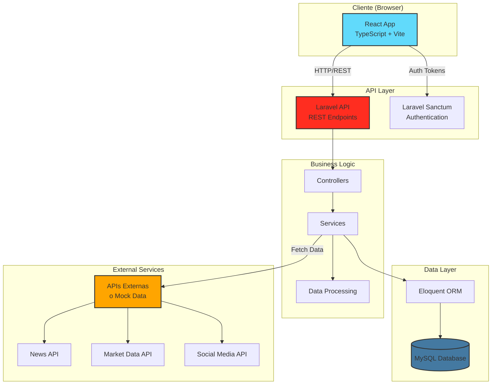

---

## 2. Arquitectura de 3 Capas Detallada

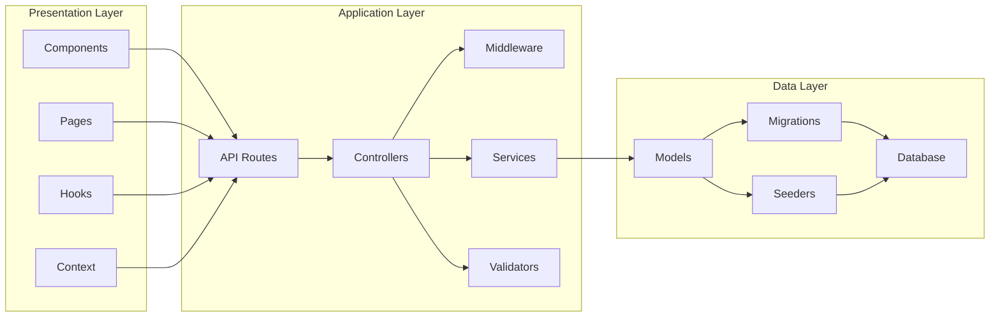

---

## 3. Flujo de Autenticación

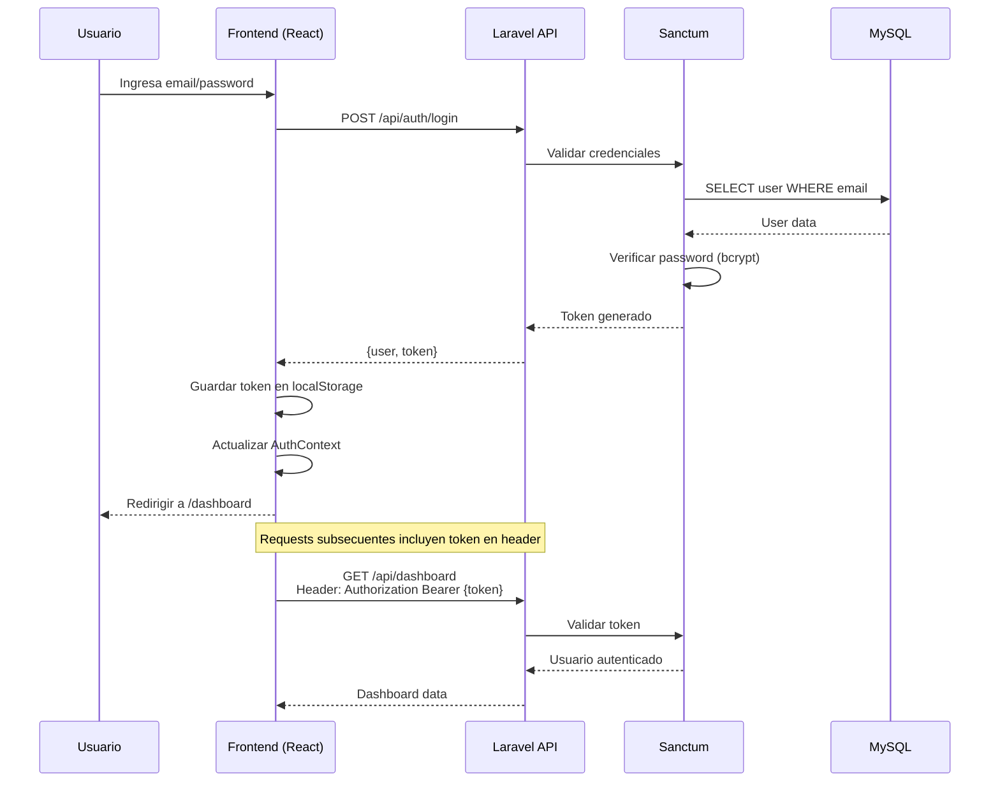

---

## 4. Flujo de Datos de Inteligencia

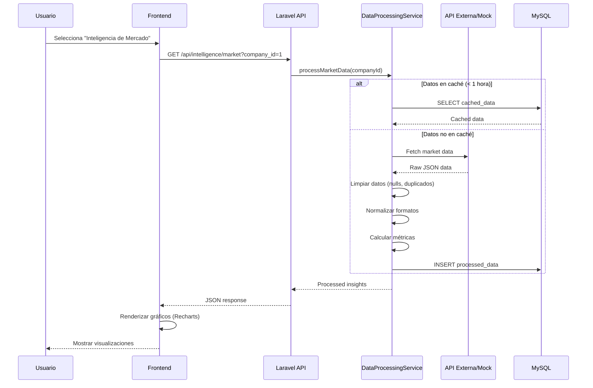

---

## 5. Estructura de Componentes Frontend

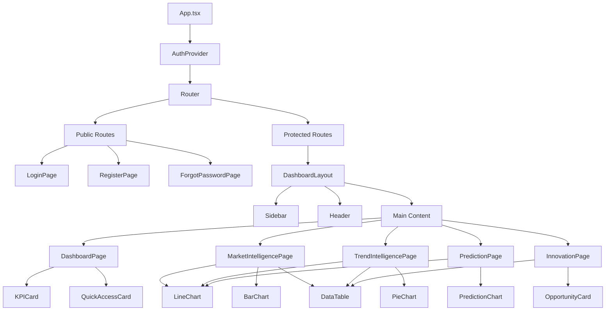

---

## 6. Estructura de Backend (Laravel)

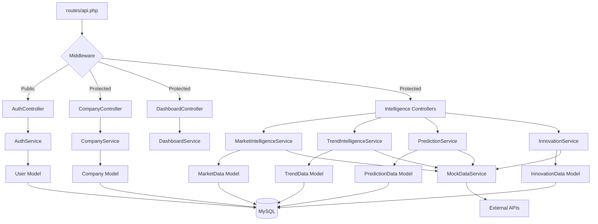

---

## 7. Patrones de Diseño Utilizados

### 7.1 Repository Pattern (Opcional)
```
Controller → Service → Repository → Model → Database
```
**Beneficio:** Abstrae acceso a datos, facilita testing

### 7.2 Service Layer Pattern
```
Controller → Service (Business Logic) → Model
```
**Beneficio:** Separa lógica de negocio de controllers

### 7.3 Provider Pattern (Frontend)
```
App → AuthProvider → Components
```
**Beneficio:** Estado global sin prop drilling

### 7.4 Custom Hooks Pattern
```
Component → useAuth() → AuthContext
Component → useIntelligence() → API Service
```
**Beneficio:** Reutilización de lógica

---

## 8. Estrategia de Caché

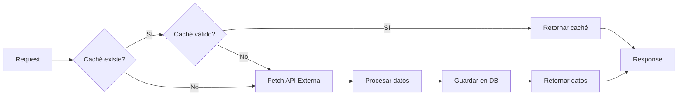

**Tiempos de caché:**
- Market Intelligence: 1 hora
- Trend Intelligence: 30 minutos
- Prediction: 6 horas
- Innovation: 24 horas

---

## 9. Manejo de Errores

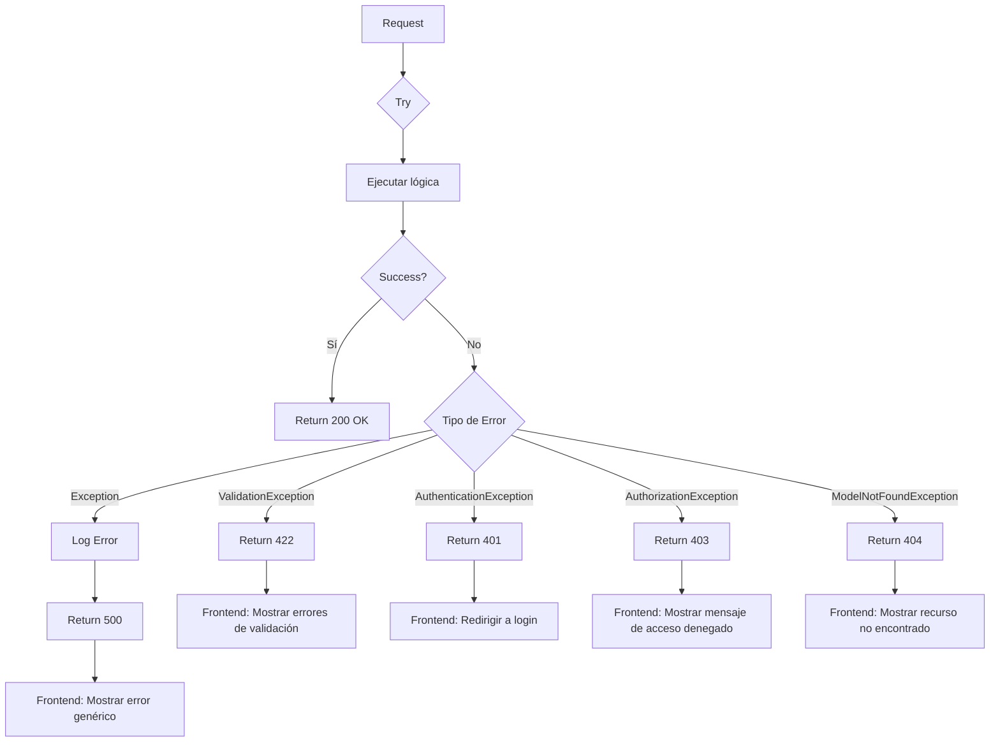

---

## 10. Seguridad en Capas

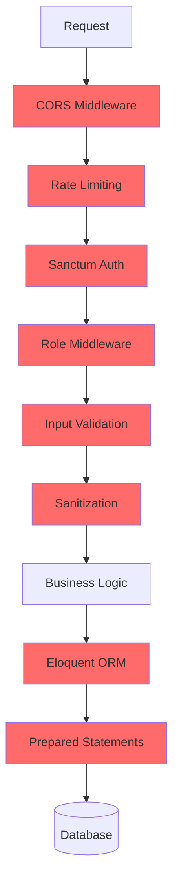

**Capas de seguridad:**
1. **CORS:** Solo dominios permitidos
2. **Rate Limiting:** Prevenir abuso
3. **Authentication:** Validar identidad
4. **Authorization:** Validar permisos
5. **Validation:** Validar formato de datos
6. **Sanitization:** Limpiar inputs (XSS)
7. **ORM:** Prevenir SQL Injection
8. **Prepared Statements:** Seguridad adicional

---

## 11. Escalabilidad Futura

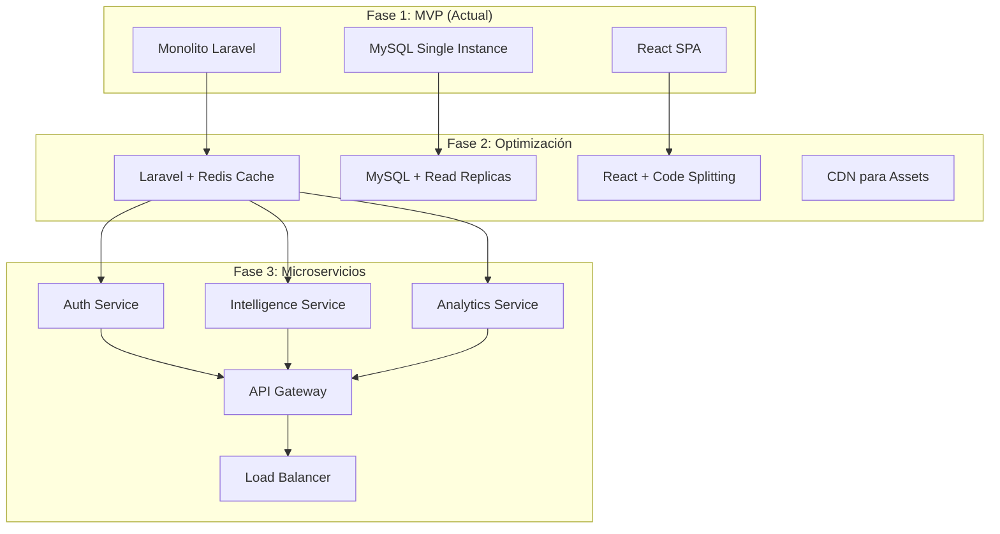

---

## 12. Deployment Architecture

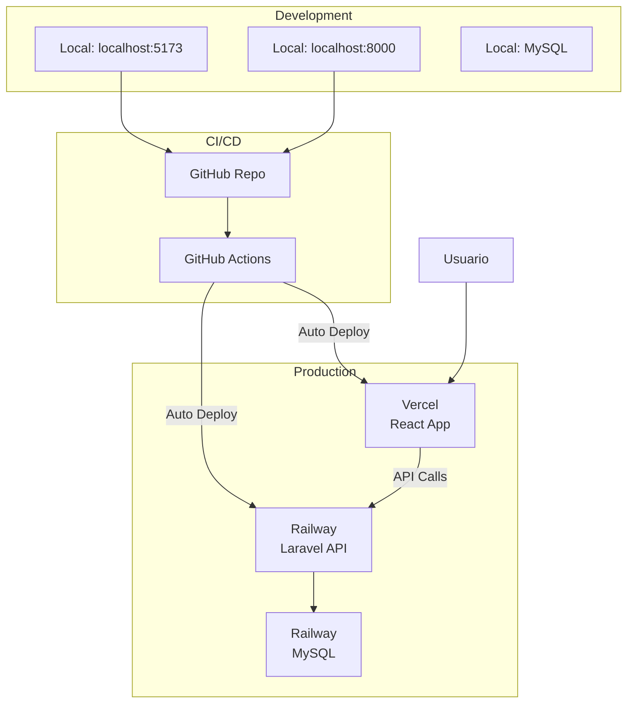

**Flujo de Deploy:**
1. Push a `main` branch
2. GitHub Actions ejecuta tests
3. Si tests pasan, deploy automático
4. Vercel despliega frontend
5. Railway despliega backend
6. Railway ejecuta migraciones

---

## 13. Consideraciones de Performance

### Frontend
- ✅ **Code Splitting:** Lazy loading de rutas
- ✅ **Memoización:** React.memo, useMemo, useCallback
- ✅ **Bundle Optimization:** Vite tree-shaking
- ✅ **Image Optimization:** WebP, lazy loading
- ✅ **Debouncing:** En búsquedas y filtros

### Backend
- ✅ **Query Optimization:** Eager loading (with())
- ✅ **Indexing:** Índices en columnas de búsqueda
- ✅ **Pagination:** Limitar resultados
- ✅ **Caching:** Redis para datos frecuentes (futuro)
- ✅ **API Rate Limiting:** Prevenir sobrecarga

---

## 14. Monitoreo y Logging

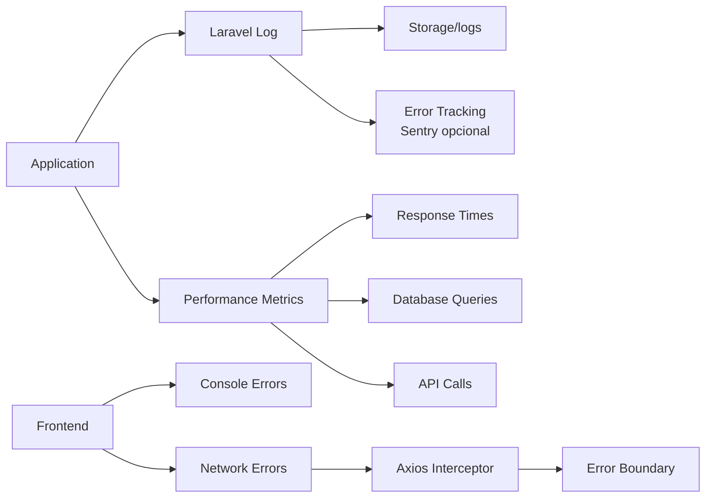

---

## 15. Tecnologías y Versiones

| Componente | Tecnología | Versión |
|------------|------------|---------|
| Frontend Framework | React | 18.x |
| Frontend Language | TypeScript | 5.x |
| Build Tool | Vite | 5.x |
| Styling | Tailwind CSS | 3.x |
| Charts | Recharts | 2.x |
| Backend Framework | Laravel | 11.x |
| Backend Language | PHP | 8.2+ |
| Database | MySQL | 8.0 |
| Authentication | Laravel Sanctum | 4.x |
| HTTP Client | Axios | 1.x |

---

**Documento creado:** 14 Feb 2026  
**Última actualización:** 14 Feb 2026  
**Estado:** ✅ Completado
