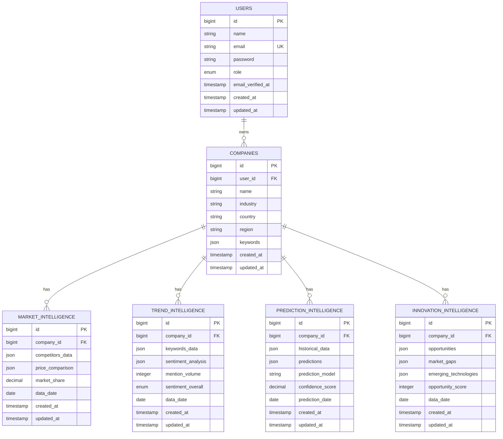

# Diseño de Base de Datos
## Plataforma de Inteligencia y Monitoreo para PYMEs

---

## 1. Diagrama Entidad-Relación (ER)



---

## 2. Esquema SQL Completo

### 2.1 Tabla: users

```sql
CREATE TABLE users (
    id BIGINT UNSIGNED AUTO_INCREMENT PRIMARY KEY,
    name VARCHAR(255) NOT NULL,
    email VARCHAR(255) NOT NULL UNIQUE,
    password VARCHAR(255) NOT NULL,
    role ENUM('admin', 'user') DEFAULT 'user',
    email_verified_at TIMESTAMP NULL,
    remember_token VARCHAR(100) NULL,
    created_at TIMESTAMP DEFAULT CURRENT_TIMESTAMP,
    updated_at TIMESTAMP DEFAULT CURRENT_TIMESTAMP ON UPDATE CURRENT_TIMESTAMP,
    
    INDEX idx_email (email),
    INDEX idx_role (role)
) ENGINE=InnoDB DEFAULT CHARSET=utf8mb4 COLLATE=utf8mb4_unicode_ci;
```

**Campos:**
- `id`: Identificador único del usuario
- `name`: Nombre completo del usuario
- `email`: Email único para login
- `password`: Contraseña hasheada con bcrypt
- `role`: Rol del usuario (admin o user)
- `email_verified_at`: Fecha de verificación de email
- `remember_token`: Token para "recordarme"

**Índices:**
- `email`: Para búsquedas rápidas en login
- `role`: Para filtrar por rol

---

### 2.2 Tabla: companies

```sql
CREATE TABLE companies (
    id BIGINT UNSIGNED AUTO_INCREMENT PRIMARY KEY,
    user_id BIGINT UNSIGNED NOT NULL,
    name VARCHAR(255) NOT NULL,
    industry VARCHAR(100) NOT NULL,
    country VARCHAR(100) NOT NULL,
    region VARCHAR(100) NOT NULL,
    keywords JSON NULL,
    created_at TIMESTAMP DEFAULT CURRENT_TIMESTAMP,
    updated_at TIMESTAMP DEFAULT CURRENT_TIMESTAMP ON UPDATE CURRENT_TIMESTAMP,
    
    FOREIGN KEY (user_id) REFERENCES users(id) ON DELETE CASCADE,
    INDEX idx_user_id (user_id),
    INDEX idx_industry (industry),
    INDEX idx_country (country)
) ENGINE=InnoDB DEFAULT CHARSET=utf8mb4 COLLATE=utf8mb4_unicode_ci;
```

**Campos:**
- `id`: Identificador único de la empresa
- `user_id`: Referencia al usuario propietario
- `name`: Nombre de la empresa
- `industry`: Industria/sector (ej: "Tecnología", "Retail")
- `country`: País de operación
- `region`: Región específica
- `keywords`: Array JSON de palabras clave de interés

**Relaciones:**
- Un usuario puede tener una empresa (1:1 en MVP, 1:N en futuro)

**Ejemplo de keywords JSON:**
```json
["marketing digital", "redes sociales", "e-commerce", "SEO"]
```

---

### 2.3 Tabla: market_intelligence

```sql
CREATE TABLE market_intelligence (
    id BIGINT UNSIGNED AUTO_INCREMENT PRIMARY KEY,
    company_id BIGINT UNSIGNED NOT NULL,
    competitors_data JSON NOT NULL,
    price_comparison JSON NOT NULL,
    market_share DECIMAL(5,2) DEFAULT 0.00,
    data_date DATE NOT NULL,
    created_at TIMESTAMP DEFAULT CURRENT_TIMESTAMP,
    updated_at TIMESTAMP DEFAULT CURRENT_TIMESTAMP ON UPDATE CURRENT_TIMESTAMP,
    
    FOREIGN KEY (company_id) REFERENCES companies(id) ON DELETE CASCADE,
    INDEX idx_company_id (company_id),
    INDEX idx_data_date (data_date),
    UNIQUE KEY unique_company_date (company_id, data_date)
) ENGINE=InnoDB DEFAULT CHARSET=utf8mb4 COLLATE=utf8mb4_unicode_ci;
```

**Campos:**
- `competitors_data`: Datos de competidores en JSON
- `price_comparison`: Comparativa de precios
- `market_share`: Porcentaje de cuota de mercado (0-100)
- `data_date`: Fecha de los datos

**Ejemplo de competitors_data:**
```json
[
  {
    "name": "Competidor A",
    "market_share": 35.5,
    "avg_price": 99.99,
    "products": 150
  },
  {
    "name": "Competidor B",
    "market_share": 28.3,
    "avg_price": 89.99,
    "products": 120
  }
]
```

**Ejemplo de price_comparison:**
```json
{
  "our_avg_price": 95.00,
  "market_avg_price": 92.50,
  "lowest_price": 79.99,
  "highest_price": 129.99,
  "price_position": "above_average"
}
```

---

### 2.4 Tabla: trend_intelligence

```sql
CREATE TABLE trend_intelligence (
    id BIGINT UNSIGNED AUTO_INCREMENT PRIMARY KEY,
    company_id BIGINT UNSIGNED NOT NULL,
    keywords_data JSON NOT NULL,
    sentiment_analysis JSON NOT NULL,
    mention_volume INT DEFAULT 0,
    sentiment_overall ENUM('positive', 'neutral', 'negative') DEFAULT 'neutral',
    data_date DATE NOT NULL,
    created_at TIMESTAMP DEFAULT CURRENT_TIMESTAMP,
    updated_at TIMESTAMP DEFAULT CURRENT_TIMESTAMP ON UPDATE CURRENT_TIMESTAMP,
    
    FOREIGN KEY (company_id) REFERENCES companies(id) ON DELETE CASCADE,
    INDEX idx_company_id (company_id),
    INDEX idx_data_date (data_date),
    INDEX idx_sentiment (sentiment_overall),
    UNIQUE KEY unique_company_date (company_id, data_date)
) ENGINE=InnoDB DEFAULT CHARSET=utf8mb4 COLLATE=utf8mb4_unicode_ci;
```

**Campos:**
- `keywords_data`: Datos de keywords trending
- `sentiment_analysis`: Análisis de sentimiento detallado
- `mention_volume`: Volumen total de menciones
- `sentiment_overall`: Sentimiento general del día

**Ejemplo de keywords_data:**
```json
[
  {
    "keyword": "marketing digital",
    "volume": 1250,
    "trend": "up",
    "change_percent": 15.5
  },
  {
    "keyword": "redes sociales",
    "volume": 980,
    "trend": "stable",
    "change_percent": 2.1
  }
]
```

**Ejemplo de sentiment_analysis:**
```json
{
  "positive": 450,
  "neutral": 320,
  "negative": 130,
  "positive_percent": 50.0,
  "neutral_percent": 35.6,
  "negative_percent": 14.4,
  "top_positive_mentions": ["excelente servicio", "muy recomendado"],
  "top_negative_mentions": ["mala atención", "producto defectuoso"]
}
```

---

### 2.5 Tabla: prediction_intelligence

```sql
CREATE TABLE prediction_intelligence (
    id BIGINT UNSIGNED AUTO_INCREMENT PRIMARY KEY,
    company_id BIGINT UNSIGNED NOT NULL,
    historical_data JSON NOT NULL,
    predictions JSON NOT NULL,
    prediction_model VARCHAR(50) DEFAULT 'linear_regression',
    confidence_score DECIMAL(5,2) DEFAULT 0.00,
    prediction_date DATE NOT NULL,
    created_at TIMESTAMP DEFAULT CURRENT_TIMESTAMP,
    updated_at TIMESTAMP DEFAULT CURRENT_TIMESTAMP ON UPDATE CURRENT_TIMESTAMP,
    
    FOREIGN KEY (company_id) REFERENCES companies(id) ON DELETE CASCADE,
    INDEX idx_company_id (company_id),
    INDEX idx_prediction_date (prediction_date),
    UNIQUE KEY unique_company_date (company_id, prediction_date)
) ENGINE=InnoDB DEFAULT CHARSET=utf8mb4 COLLATE=utf8mb4_unicode_ci;
```

**Campos:**
- `historical_data`: Datos históricos usados
- `predictions`: Predicciones generadas
- `prediction_model`: Modelo usado (ej: "linear_regression")
- `confidence_score`: Score de confianza (0-100)
- `prediction_date`: Fecha para la cual se predice

**Ejemplo de historical_data:**
```json
[
  {"date": "2026-01-01", "value": 15000},
  {"date": "2026-01-15", "value": 16200},
  {"date": "2026-02-01", "value": 17500},
  {"date": "2026-02-15", "value": 18100}
]
```

**Ejemplo de predictions:**
```json
[
  {"date": "2026-03-01", "predicted_value": 19200, "lower_bound": 18500, "upper_bound": 19900},
  {"date": "2026-03-15", "predicted_value": 20100, "lower_bound": 19300, "upper_bound": 20900},
  {"date": "2026-04-01", "predicted_value": 21000, "lower_bound": 20100, "upper_bound": 21900}
]
```

---

### 2.6 Tabla: innovation_intelligence

```sql
CREATE TABLE innovation_intelligence (
    id BIGINT UNSIGNED AUTO_INCREMENT PRIMARY KEY,
    company_id BIGINT UNSIGNED NOT NULL,
    opportunities JSON NOT NULL,
    market_gaps JSON NOT NULL,
    emerging_technologies JSON NOT NULL,
    opportunity_score INT DEFAULT 0,
    data_date DATE NOT NULL,
    created_at TIMESTAMP DEFAULT CURRENT_TIMESTAMP,
    updated_at TIMESTAMP DEFAULT CURRENT_TIMESTAMP ON UPDATE CURRENT_TIMESTAMP,
    
    FOREIGN KEY (company_id) REFERENCES companies(id) ON DELETE CASCADE,
    INDEX idx_company_id (company_id),
    INDEX idx_data_date (data_date),
    INDEX idx_opportunity_score (opportunity_score),
    UNIQUE KEY unique_company_date (company_id, data_date)
) ENGINE=InnoDB DEFAULT CHARSET=utf8mb4 COLLATE=utf8mb4_unicode_ci;
```

**Campos:**
- `opportunities`: Oportunidades detectadas
- `market_gaps`: Vacíos en el mercado
- `emerging_technologies`: Tecnologías emergentes relevantes
- `opportunity_score`: Score de oportunidad (0-100)

**Ejemplo de opportunities:**
```json
[
  {
    "title": "Mercado de productos eco-friendly",
    "description": "Creciente demanda de productos sustentables",
    "potential_revenue": 50000,
    "difficulty": "medium",
    "timeframe": "6 months"
  },
  {
    "title": "Automatización de procesos",
    "description": "Oportunidad de reducir costos operativos",
    "potential_savings": 30000,
    "difficulty": "low",
    "timeframe": "3 months"
  }
]
```

**Ejemplo de market_gaps:**
```json
[
  {
    "gap": "Falta de servicio al cliente 24/7",
    "impact": "high",
    "competitors_filling": 2
  },
  {
    "gap": "Opciones de pago limitadas",
    "impact": "medium",
    "competitors_filling": 5
  }
]
```

---

### 2.7 Tabla: password_reset_tokens (Laravel default)

```sql
CREATE TABLE password_reset_tokens (
    email VARCHAR(255) PRIMARY KEY,
    token VARCHAR(255) NOT NULL,
    created_at TIMESTAMP DEFAULT CURRENT_TIMESTAMP,
    
    INDEX idx_email (email)
) ENGINE=InnoDB DEFAULT CHARSET=utf8mb4 COLLATE=utf8mb4_unicode_ci;
```

---

### 2.8 Tabla: personal_access_tokens (Laravel Sanctum)

```sql
CREATE TABLE personal_access_tokens (
    id BIGINT UNSIGNED AUTO_INCREMENT PRIMARY KEY,
    tokenable_type VARCHAR(255) NOT NULL,
    tokenable_id BIGINT UNSIGNED NOT NULL,
    name VARCHAR(255) NOT NULL,
    token VARCHAR(64) NOT NULL UNIQUE,
    abilities TEXT NULL,
    last_used_at TIMESTAMP NULL,
    expires_at TIMESTAMP NULL,
    created_at TIMESTAMP DEFAULT CURRENT_TIMESTAMP,
    updated_at TIMESTAMP DEFAULT CURRENT_TIMESTAMP ON UPDATE CURRENT_TIMESTAMP,
    
    INDEX idx_tokenable (tokenable_type, tokenable_id),
    INDEX idx_token (token)
) ENGINE=InnoDB DEFAULT CHARSET=utf8mb4 COLLATE=utf8mb4_unicode_ci;
```

---

## 3. Normalización

### Forma Normal Aplicada: 3FN (Tercera Forma Normal)

**1FN (Primera Forma Normal):**
- ✅ Todos los campos contienen valores atómicos
- ✅ No hay grupos repetidos
- ✅ Cada columna tiene un nombre único

**2FN (Segunda Forma Normal):**
- ✅ Cumple 1FN
- ✅ Todos los atributos no clave dependen completamente de la clave primaria
- ✅ No hay dependencias parciales

**3FN (Tercera Forma Normal):**
- ✅ Cumple 2FN
- ✅ No hay dependencias transitivas
- ✅ Cada atributo no clave depende solo de la clave primaria

**Uso de JSON:**
- Los campos JSON (`keywords`, `competitors_data`, etc.) almacenan datos semi-estructurados que varían
- Esto es aceptable porque estos datos no se consultan individualmente con frecuencia
- Facilita flexibilidad sin crear múltiples tablas relacionales

---

## 4. Índices y Optimización

### Índices Creados

| Tabla | Columna(s) | Tipo | Propósito |
|-------|-----------|------|-----------|
| users | email | UNIQUE | Login rápido |
| users | role | INDEX | Filtrar por rol |
| companies | user_id | INDEX | Join con users |
| companies | industry | INDEX | Filtrar por industria |
| market_intelligence | company_id | INDEX | Join con companies |
| market_intelligence | data_date | INDEX | Filtrar por fecha |
| market_intelligence | (company_id, data_date) | UNIQUE | Evitar duplicados |
| trend_intelligence | company_id | INDEX | Join con companies |
| trend_intelligence | data_date | INDEX | Filtrar por fecha |
| trend_intelligence | sentiment_overall | INDEX | Filtrar por sentimiento |

**Estrategia de Indexación:**
- Índices en foreign keys para joins rápidos
- Índices en columnas de filtrado frecuente (fecha, rol, industria)
- Índices únicos compuestos para evitar duplicados

---

## 5. Relaciones

### 5.1 User → Company (1:1 en MVP, 1:N futuro)

```php
// User Model
public function company() {
    return $this->hasOne(Company::class);
}

// Company Model
public function user() {
    return $this->belongsTo(User::class);
}
```

### 5.2 Company → Intelligence Data (1:N)

```php
// Company Model
public function marketIntelligence() {
    return $this->hasMany(MarketIntelligence::class);
}

public function trendIntelligence() {
    return $this->hasMany(TrendIntelligence::class);
}

public function predictionIntelligence() {
    return $this->hasMany(PredictionIntelligence::class);
}

public function innovationIntelligence() {
    return $this->hasMany(InnovationIntelligence::class);
}
```

---

## 6. Seeders de Ejemplo

### 6.1 User Seeder

```php
User::create([
    'name' => 'Admin User',
    'email' => 'admin@example.com',
    'password' => bcrypt('password'),
    'role' => 'admin',
    'email_verified_at' => now(),
]);

User::create([
    'name' => 'Demo User',
    'email' => 'demo@example.com',
    'password' => bcrypt('password'),
    'role' => 'user',
    'email_verified_at' => now(),
]);
```

### 6.2 Company Seeder

```php
Company::create([
    'user_id' => 2,
    'name' => 'TechStart SV',
    'industry' => 'Tecnología',
    'country' => 'El Salvador',
    'region' => 'San Salvador',
    'keywords' => json_encode([
        'desarrollo web',
        'apps móviles',
        'cloud computing',
        'inteligencia artificial'
    ]),
]);
```

---

## 7. Migraciones Laravel

### Orden de Ejecución

1. `2024_01_01_000000_create_users_table.php`
2. `2024_01_01_000001_create_password_reset_tokens_table.php`
3. `2024_01_01_000002_create_personal_access_tokens_table.php`
4. `2024_01_02_000000_create_companies_table.php`
5. `2024_01_03_000000_create_market_intelligence_table.php`
6. `2024_01_03_000001_create_trend_intelligence_table.php`
7. `2024_01_03_000002_create_prediction_intelligence_table.php`
8. `2024_01_03_000003_create_innovation_intelligence_table.php`

---

## 8. Consideraciones de Escalabilidad

### Particionamiento Futuro
- Particionar tablas de inteligencia por fecha (mensual)
- Archivar datos antiguos (> 1 año)

### Replicación
- Master-Slave para lectura/escritura
- Read replicas para consultas pesadas

### Caché
- Redis para datos frecuentes
- Invalidación de caché al actualizar

---

## 9. Backup y Recuperación

### Estrategia de Backup
- **Diario:** Backup completo de base de datos
- **Horario:** Backup incremental cada 6 horas
- **Retención:** 30 días de backups
- **Ubicación:** Almacenamiento externo (S3, Google Cloud Storage)

### Comandos de Backup

```bash
# Backup completo
mysqldump -u root -p pyme_intelligence > backup_$(date +%Y%m%d).sql

# Restauración
mysql -u root -p pyme_intelligence < backup_20260214.sql
```

---

## 10. Seguridad de Datos

### Encriptación
- ✅ Contraseñas: bcrypt (Laravel default)
- ✅ Tokens: SHA-256 (Sanctum)
- ✅ Conexión: SSL/TLS en producción

### Validación
- ✅ Foreign keys con ON DELETE CASCADE
- ✅ Constraints de unicidad
- ✅ Validación de tipos de datos

### Auditoría
- ✅ Timestamps en todas las tablas
- ✅ Soft deletes (futuro)
- ✅ Logging de cambios críticos

---

**Documento creado:** 14 Feb 2026  
**Última actualización:** 14 Feb 2026  
**Estado:** ✅ Completado
